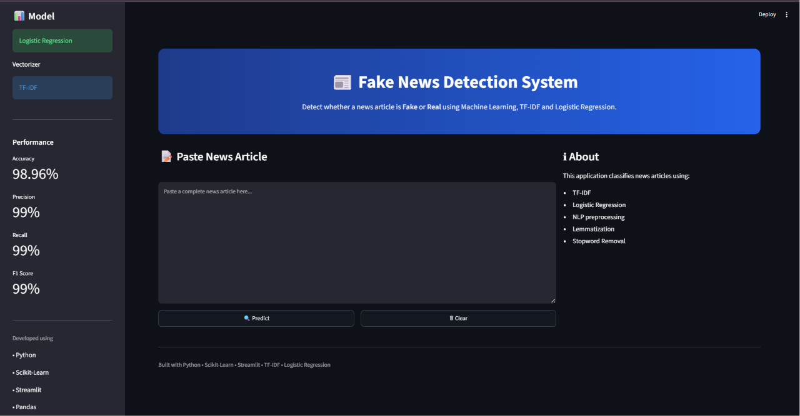

# 📰 Fake News Detection System

A Machine Learning-based web application that classifies news articles as **Fake** or **Real** using Natural Language Processing (NLP) techniques and Logistic Regression.

---

## 📌 Features

- Detects Fake and Real News
- Text preprocessing using NLP
- TF-IDF Vectorization
- Logistic Regression classifier
- Interactive Streamlit web application
- Confidence score visualization
- Clean and responsive user interface

---

## 🛠 Tech Stack

- Python
- Scikit-Learn
- Streamlit
- Pandas
- NumPy
- NLTK
- Plotly
- Joblib

---

## 📂 Project Structure

```
Fake News Detection/
│
├── dataset/
│   ├── Fake.csv
│   ├── True.csv
│   └── processed_news.csv
│
├── models/
│   ├── best_model.pkl
│   └── tfidf_vectorizer.pkl
│
├── src/
│   ├── preprocess.py
│   ├── text_preprocessing.py
│   ├── train_model.py
│   └── predict.py
│
├── app.py
├── requirements.txt
└── README.md
```

---

## ⚙ Installation

Clone the repository

```bash
git clone https://github.com/yourusername/Fake-News-Detection.git
```

Go to project

```bash
cd Fake-News-Detection
```

Install dependencies

```bash
pip install -r requirements.txt
```

Run the application

```bash
python -m streamlit run app.py
```

---

## 📊 Machine Learning Pipeline

- Dataset Collection
- Data Cleaning
- Stopword Removal
- Lemmatization
- TF-IDF Vectorization
- Logistic Regression Training
- Model Evaluation
- Streamlit Deployment

---

## 📈 Model Performance

| Metric | Score |
|---------|--------|
| Accuracy | 98.96% |
| Precision | 99% |
| Recall | 99% |
| F1 Score | 99% |

---

## 📷 Screenshots

### Home Page



### Prediction Result


---

## 📚 Dataset

- Fake.csv
- True.csv

Source:
https://www.kaggle.com/datasets/algozee/fake-news

---

## 👩‍💻 Author

**Likhila Vydana**

GitHub:
https://github.com/likhilavyd

Portfolio:
https://likhilavyd.github.io/portfolio/

LinkedIn:
https://www.linkedin.com/in/likhila-vydana-aab074325
